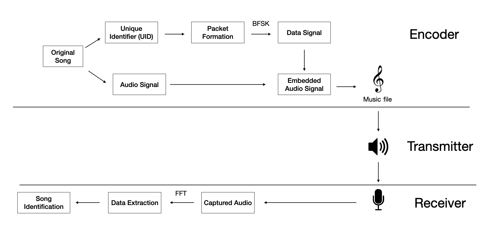

# musical-guacamole
Transmitter and Receiver for Sound-based Quick Response Code for songs

Encoder (Python): generate unique ids and encode into songs BFSK.

Transmitter: Any regular to play a normal music file.

Receiver (Swift): analyzes signals recorded from phone's microphone to decode unique ids and recognize songs.

Overall System Design:

## Run
Simply compile and run in xcode!

Transmitters are in jupyter notebook files, e.g. `soundqr-build.ipynb`.

## Main interface
The main interface has a start button and shows the name of song when recognized

## Requirement
This code uses SwiftUI, so it requires target devices to be at IOS 13 or later.

## Limitations
This code has been tested thoroughly on iPad 6th gen.